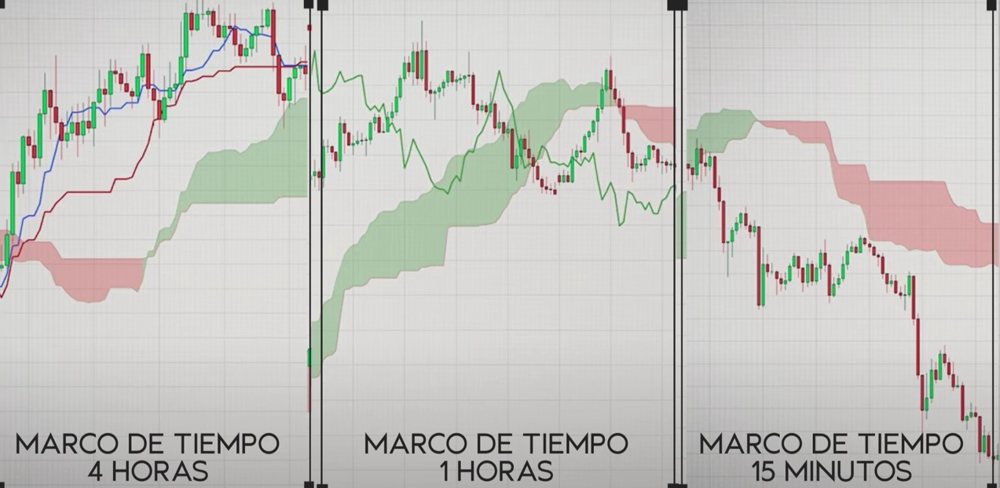
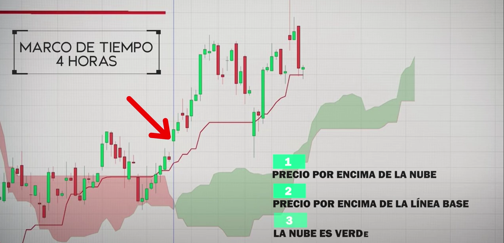
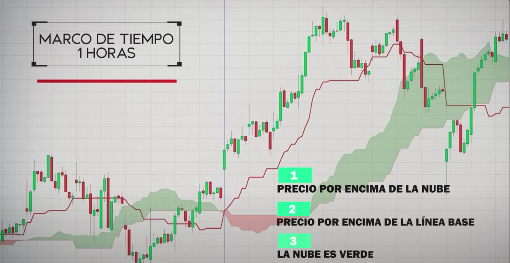
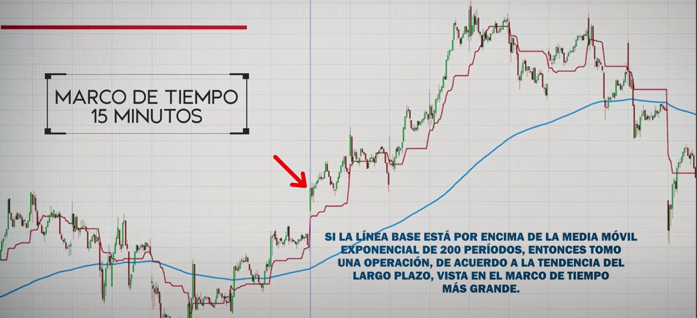
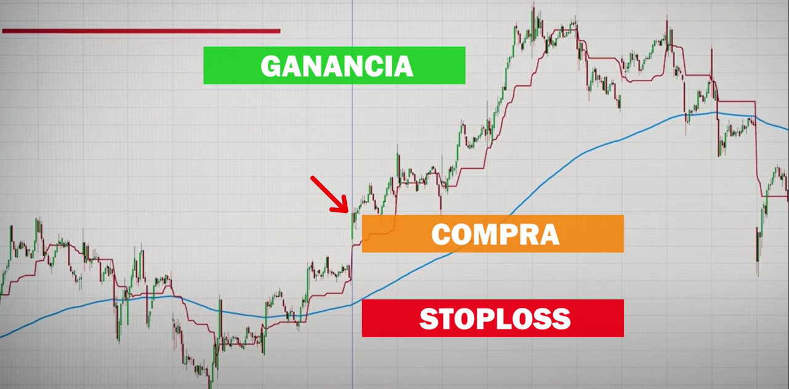

# Nube Ichimoku

La nube de Ichimoku, también conocida como Ichimoku Kinko Hyo, es un indicador popular y flexible que muestra el soporte y la resistencia, el momentum y la dirección de la tendencia de un valor. Proporciona una imagen más clara del movimiento del precio a simple vista. Puede identificar la dirección de una tendencia, valorar el momentum y señalar las oportunidades de trading basándose en los cruces de línea y dónde se encuentra el precio respecto a estas líneas. Estas señales ayudan a los traders a encontrar los puntos de entrada y salida más óptimos. El indicador se compone de cinco líneas (cada una representa un intervalo de tiempo diferente) y fue desarrollado por Goichi Hosoda, un periodista que pasó mucho tiempo mejorando esta técnica de análisis técnico antes de compartirlo públicamente a finales de 1960.}

## Estrategia

## Recursos
- [Nube Ichimoku](https://www.youtube.com/watch?v=8yJio2_fwQY)